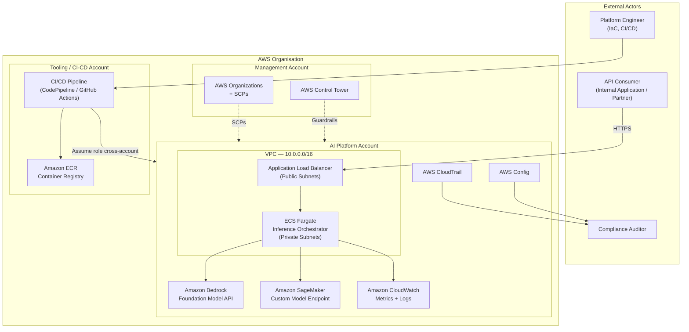
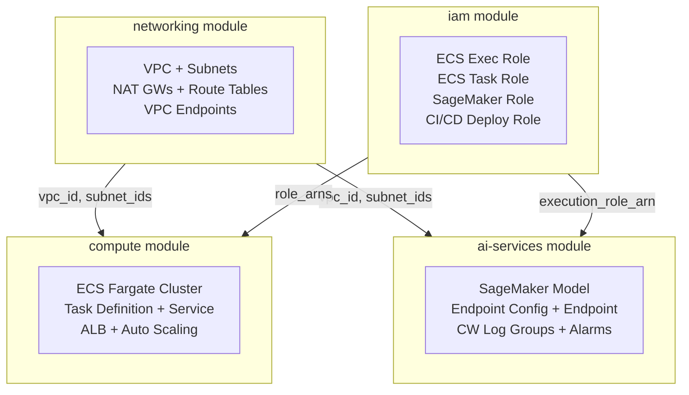
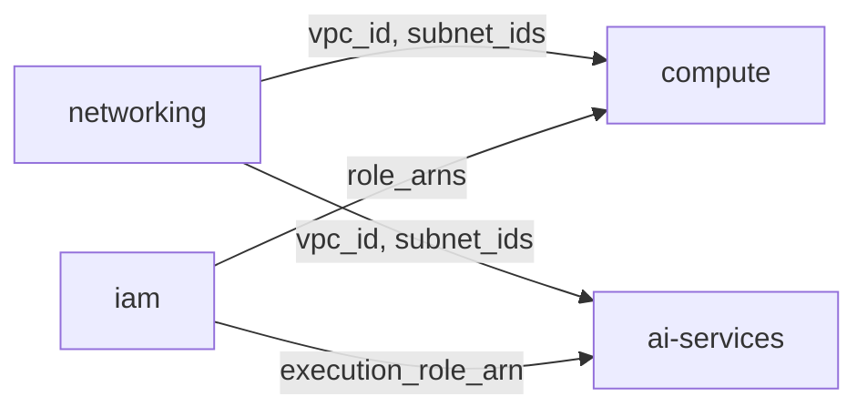

# Design Document — AI Platform Operations

## Overview

The AI Platform Operations framework provides a structured, opinionated baseline for running enterprise AI workloads on AWS. It is not a single application — it is an operational system that spans four interconnected domains: DevOps, Platform Engineering, Security, and Governance.

The platform addresses a real challenge in enterprise AI adoption: the gap between model capability and operational readiness. Teams can access powerful foundation models through Amazon Bedrock and deploy custom models via Amazon SageMaker, but without a consistent operational framework, these capabilities remain fragile, expensive to govern, and difficult to secure at scale.

This design establishes that framework. It defines the infrastructure architecture, security posture, operational model, and governance controls that allow a platform team to run AI workloads with the confidence expected of production enterprise systems.

**Operational Domains:**

| Domain | Scope |
|---|---|
| DevOps | CI/CD pipelines, infrastructure automation, deployment strategies, rollback controls |
| Platform Engineering | Reusable IaC modules, environment promotion, naming standards, dependency management |
| Security | IAM least-privilege, encryption at rest and in transit, network isolation, compliance controls |
| Governance | AI model governance, cost allocation, policy enforcement, audit trails |

**AWS Well-Architected Alignment:** All design decisions are mapped to the six pillars — Operational Excellence, Security, Reliability, Performance Efficiency, Cost Optimisation, and Sustainability — in the dedicated alignment section.


---

## Architecture

### Architecture Goals

The platform is designed to satisfy the following architectural goals, which collectively shape every decision in this document:

1. **Security by default** — no workload reaches production without passing IAM least-privilege review, encryption validation, and network isolation checks.
2. **Reproducible environments** — all infrastructure is defined as code; no manual console changes; any environment can be re-created from state in under 30 minutes.
3. **Observable at every layer** — metrics, logs, and traces are available for inference requests, infrastructure components, and platform operations without custom instrumentation.
4. **Cost-transparent** — every resource carries allocation tags; cost attribution to team, environment, and model is available in AWS Cost Explorer within 24 hours of creation.
5. **Governed at scale** — AI model deployments are gated by approval workflows; policy violations are detected automatically; audit trails are immutable.

### Non-Functional Requirements

| NFR | Target | Measurement |
|---|---|---|
| Availability | ≥ 99.9% uptime for inference endpoints | CloudWatch availability metric over 30-day window |
| Inference latency | p95 ≤ 2 seconds end-to-end | ALB TargetResponseTime p95 |
| Throughput | ≥ 100 concurrent inference requests | ALB ActiveConnectionCount under load test |
| Recovery time objective (RTO) | ≤ 1 hour | Time from incident declaration to service restoration |
| Recovery point objective (RPO) | ≤ 15 minutes | Maximum data loss window for stateful components |
| Deployment frequency | On-demand with same-day turnaround | CI/CD pipeline execution time |
| Change failure rate | < 5% of deployments require rollback | Deployment circuit-breaker trigger rate |


### AWS Service Selection

| Concern | Selected Service | Rationale |
|---|---|---|
| AI inference — foundation models | Amazon Bedrock | Serverless FM API; pay-per-token; no infrastructure; cross-region inference profiles available |
| AI inference — custom models | Amazon SageMaker | Full MLOps lifecycle; BYOC support; multi-framework real-time endpoints; model monitoring built-in |
| Container compute | Amazon ECS Fargate | Serverless containers; no EC2 capacity management; native ALB integration; Container Insights enabled |
| Observability | Amazon CloudWatch | Native AWS metrics, structured logs, dashboards, and alarms; deep ECS and SageMaker integration |
| Network isolation | Amazon VPC + VPC Endpoints | Private connectivity to Bedrock, SageMaker, ECR, S3, and CloudWatch Logs without internet traversal |
| Load balancing | Application Load Balancer | HTTP/HTTPS routing; WAF integration; access logging to S3 |
| Secrets management | AWS Secrets Manager | API keys, model credentials, and environment secrets; automatic rotation support |
| Remote state | Amazon S3 + DynamoDB | Terraform state with server-side encryption and conditional write locking |
| Identity | AWS IAM | Role-based least-privilege per component; condition keys for resource scoping |
| Compliance | AWS CloudTrail + Config | Immutable API audit log; continuous resource configuration recording |


### System Context

The AI Platform sits within a broader AWS organisation. The diagram below shows the system boundary and external actors.




### VPC Network Topology

```
┌─────────────────────────── VPC: 10.0.0.0/16 ──────────────────────────────┐
│                                                                              │
│  ┌─────────── AZ-a ──────────────┐  ┌─────────── AZ-b ──────────────┐     │
│  │  Public Subnet: 10.0.1.0/24   │  │  Public Subnet: 10.0.2.0/24   │     │
│  │  [NAT GW]  [ALB Node]         │  │  [NAT GW]  [ALB Node]         │     │
│  │                               │  │                               │     │
│  │  Private Subnet: 10.0.11.0/24 │  │  Private Subnet: 10.0.12.0/24│     │
│  │  [ECS Fargate Tasks]          │  │  [ECS Fargate Tasks]          │     │
│  │  [SageMaker VPC Endpoint]     │  │                               │     │
│  └───────────────────────────────┘  └───────────────────────────────┘     │
│                                                                              │
│  VPC Interface Endpoints (private DNS):                                     │
│    com.amazonaws.*.bedrock-runtime                                          │
│    com.amazonaws.*.sagemaker.runtime                                        │
│    com.amazonaws.*.ecr.dkr  /  ecr.api                                     │
│    com.amazonaws.*.logs                                                     │
│  VPC Gateway Endpoint: com.amazonaws.*.s3                                   │
└──────────────────────────────────────────────────────────────────────────────┘
                    │
            Internet Gateway
            (public subnets only)
```

All AI service calls (Bedrock InvokeModel, SageMaker InvokeEndpoint) traverse VPC interface endpoints and never leave the AWS network. ECR image pulls and CloudWatch log delivery are likewise private. This eliminates the need for internet-bound NAT for AI service calls and reduces the attack surface of the compute layer.


---

## Components and Interfaces

### Component Overview



### Module: `networking`

**Responsibility:** Provision the complete network foundation — VPC, subnets, internet gateway, NAT gateways, route tables, route table associations, and VPC endpoints for all AWS services used by the platform.

**Design rationale:** Isolating network concerns into a dedicated module means compute, IAM, and AI service modules can be deployed, updated, and tested independently. The networking module is the slowest-changing layer and should have the highest stability.

**Input interface:**

| Variable | Type | Description | Default |
|---|---|---|---|
| `project_name` | string | Resource name prefix | — |
| `environment` | string | Deployment stage: dev, staging, prod | — |
| `vpc_cidr` | string | VPC CIDR block | `10.0.0.0/16` |
| `public_subnet_cidrs` | list(string) | Public subnet CIDRs, one per AZ | `["10.0.1.0/24","10.0.2.0/24"]` |
| `private_subnet_cidrs` | list(string) | Private subnet CIDRs, one per AZ | `["10.0.11.0/24","10.0.12.0/24"]` |
| `availability_zones` | list(string) | AZ names to deploy into | — |
| `enable_nat_gateway` | bool | Create NAT gateways | `true` |
| `single_nat_gateway` | bool | Share one NAT GW across all AZs (cost trade-off) | `false` |

**Output interface:**

| Output | Type | Description |
|---|---|---|
| `vpc_id` | string | ID of the VPC |
| `public_subnet_ids` | list(string) | IDs of all public subnets |
| `private_subnet_ids` | list(string) | IDs of all private subnets |
| `nat_gateway_ids` | list(string) | IDs of NAT gateways |
| `vpc_cidr_block` | string | VPC CIDR for security group rule references |


### Module: `compute`

**Responsibility:** Provision the ECS Fargate cluster, task definition, service, Application Load Balancer, security groups, and Auto Scaling policies for the AI inference orchestrator container.

**Design rationale:** ECS Fargate was selected over EKS and Lambda. See ADR-001 for the full decision record. The inference orchestrator is the runtime bridge between external consumers and the Bedrock/SageMaker APIs — it handles request routing, authentication, rate limiting, and response formatting.

**Input interface:**

| Variable | Type | Description | Default |
|---|---|---|---|
| `project_name` | string | Resource name prefix | — |
| `environment` | string | Deployment stage | — |
| `vpc_id` | string | VPC ID from networking module | — |
| `private_subnet_ids` | list(string) | Subnets for ECS tasks | — |
| `public_subnet_ids` | list(string) | Subnets for the ALB | — |
| `container_image` | string | ECR image URI for the orchestrator | — |
| `container_port` | number | Port exposed by the container | `8080` |
| `desired_count` | number | Initial ECS task count | `2` |
| `task_cpu` | number | vCPU units (1024 = 1 vCPU) | `1024` |
| `task_memory` | number | Memory in MiB | `2048` |
| `ecs_task_execution_role_arn` | string | ECS execution role ARN from iam module | — |
| `ecs_task_role_arn` | string | ECS task role ARN (Bedrock/SageMaker access) | — |
| `min_capacity` | number | Minimum task count for Auto Scaling | `2` |
| `max_capacity` | number | Maximum task count for Auto Scaling | `20` |
| `scale_up_threshold` | number | ALB requests per target to trigger scale-out | `1000` |

**Output interface:**

| Output | Type | Description |
|---|---|---|
| `ecs_cluster_arn` | string | ARN of the ECS cluster |
| `ecs_service_name` | string | Name of the ECS service |
| `alb_dns_name` | string | DNS name of the Application Load Balancer |
| `alb_arn` | string | ARN of the ALB (for WAF association) |
| `ecs_security_group_id` | string | Security group ID of ECS tasks |

**Key design choices:**
- ECS Container Insights enabled on the cluster for task-level CPU, memory, and network metrics.
- Rolling deployment with deployment circuit breaker and automatic rollback on health check failure.
- ALB health check on `/health` with a 30-second deregistration delay to drain in-flight requests.
- Security group design: ALB accepts HTTPS/443 from `0.0.0.0/0`; ECS tasks accept only on `container_port` from the ALB security group.


### Module: `iam`

**Responsibility:** Define all IAM roles and policies for the platform using least-privilege principles. Each principal in the system has a distinct role with a scoped trust policy and resource-level permission boundaries.

**Design rationale:** Centralising IAM in a dedicated module enforces a single point of review for privilege escalation paths. No compute or AI services module creates IAM resources directly — they consume role ARNs as inputs. This separation makes security audits tractable.

**Input interface:**

| Variable | Type | Description | Default |
|---|---|---|---|
| `project_name` | string | Resource name prefix | — |
| `environment` | string | Deployment stage | — |
| `bedrock_model_arns` | list(string) | Bedrock model ARNs the runtime may invoke | — |
| `sagemaker_endpoint_arns` | list(string) | SageMaker endpoint ARNs the runtime may invoke | — |
| `cicd_trusted_account_id` | string | AWS account ID trusted for CI/CD role assumption | — |

**Output interface:**

| Output | Type | Description |
|---|---|---|
| `ecs_task_execution_role_arn` | string | Allows ECS to pull images and write CloudWatch logs |
| `ecs_task_role_arn` | string | Runtime permissions: Bedrock + SageMaker + Secrets Manager |
| `sagemaker_execution_role_arn` | string | SageMaker model training and endpoint execution |
| `cicd_deployment_role_arn` | string | Cross-account Terraform deployment permissions |

**Role design:**

| Role | Trust Principal | Key Permissions | Condition Keys |
|---|---|---|---|
| ECS Task Execution | `ecs-tasks.amazonaws.com` | ECR pull, CloudWatch Logs write, Secrets Manager read | `aws:RequestedRegion` |
| ECS Task (runtime) | `ecs-tasks.amazonaws.com` | `bedrock:InvokeModel` on allowed ARNs, `sagemaker:InvokeEndpoint` on allowed ARNs | `aws:ResourceTag/Project` |
| SageMaker Execution | `sagemaker.amazonaws.com` | S3 model artefact access, ECR pull, CloudWatch Logs | `aws:RequestedRegion` |
| CI/CD Deployment | External account via `sts:AssumeRole` | Terraform plan/apply scope for ECS, SageMaker, networking | `iam:PassedToService` restricted to project roles |


### Module: `ai-services`

**Responsibility:** Provision the SageMaker model, endpoint configuration, and real-time endpoint. Configure CloudWatch log groups, metric alarms, and observability baselines for AI inference workloads.

**Design rationale:** The AI services module owns the lifecycle of custom model endpoints. It is intentionally scoped to SageMaker resources because Bedrock is a serverless API — there is no infrastructure to provision for Bedrock itself. Bedrock access is controlled through IAM (in the `iam` module) and consumed from the `compute` layer at runtime.

**Input interface:**

| Variable | Type | Description | Default |
|---|---|---|---|
| `project_name` | string | Resource name prefix | — |
| `environment` | string | Deployment stage | — |
| `execution_role_arn` | string | SageMaker execution role ARN from iam module | — |
| `model_data_url` | string | S3 URI for model artefacts (.tar.gz) | — |
| `container_image` | string | ECR/DLC image URI for the model container | — |
| `instance_type` | string | SageMaker instance type | `ml.g5.2xlarge` |
| `initial_instance_count` | number | Instances behind the endpoint | `1` |
| `log_retention_days` | number | CloudWatch log retention for inference logs | `30` |
| `kms_key_arn` | string | KMS key ARN for SageMaker volume encryption | `""` |

**Output interface:**

| Output | Type | Description |
|---|---|---|
| `sagemaker_endpoint_name` | string | Name of the SageMaker real-time endpoint |
| `sagemaker_endpoint_arn` | string | ARN of the SageMaker endpoint |
| `cloudwatch_log_group_name` | string | CloudWatch log group for inference logs |
| `sagemaker_model_name` | string | Name of the SageMaker model resource |

**Key design choices:**
- Network isolation enabled on the SageMaker model resource — the model container cannot make outbound network calls.
- `create_before_destroy` lifecycle on the endpoint resource enables zero-downtime model updates.
- CloudWatch alarms defined for `ModelLatency > 2000ms` and `InvocationError5xxRate > 1%` to trigger automated alerting.
- Log retention policy of 30 days minimum; configurable upward for compliance requirements.


---

## Data Models

### Resource Naming Convention

All resources follow the pattern: `{project_name}-{environment}-{resource_type}[-{qualifier}]`

Examples:
- `ai-platform-prod-vpc`
- `ai-platform-prod-private-subnet-0`
- `ai-platform-prod-ecs-cluster`
- `ai-platform-prod-bedrock-invoke-role`
- `ai-platform-prod-sagemaker-endpoint`

The qualifier segment is used for disambiguation when multiple instances of the same resource type exist (e.g., `subnet-0`, `subnet-1` for multi-AZ subnets).

### Tagging Strategy

All resources carry a mandatory tag set. Tags are enforced via AWS Config rules and Service Control Policies at the organisation level.

| Tag Key | Value Pattern | Purpose |
|---|---|---|
| `Project` | `ai-platform` | Cost allocation and resource grouping |
| `Environment` | `dev` / `staging` / `prod` | Environment segmentation |
| `ManagedBy` | `Terraform` | Identify IaC-managed resources |
| `Owner` | `platform-team` | Contact for ownership queries |
| `CostCentre` | `<cost-centre-id>` | Finance chargeback |
| `DataClassification` | `internal` / `confidential` | Data handling classification |

Resources missing required tags are flagged by AWS Config rule `REQUIRED_TAGS` and surfaced in Security Hub findings.

### Module Dependency Graph



The `networking` and `iam` modules have no upstream dependencies and can be applied in parallel. The `compute` and `ai-services` modules depend on outputs from both `networking` and `iam`.

### Environment Promotion Model

Environments are not separate Terraform workspaces — they are separate directory trees under `environments/`, each with their own backend configuration and variable values. This avoids workspace-based state isolation issues and makes environment differences explicit in code review.

```
terraform/
  environments/
    dev/          ← low-cost instances, single NAT GW, relaxed retention
    staging/      ← production-equivalent sizing, approval gates enabled
    prod/         ← full HA, all alarms active, deletion protection on
  modules/
    networking/
    compute/
    iam/
    ai-services/
```

Module source references use a pinned version tag (e.g., `source = "../../modules/networking"`) in early-stage deployments. For mature platforms, modules are versioned through a private Terraform registry with explicit `version = "~> 1.2"` constraints per environment.


---

## Architecture Decision Records

### ADR-001: Compute Platform — ECS Fargate over EKS and Lambda

**Status:** Accepted

**Context:**  
The inference orchestrator requires a container runtime that can handle variable request loads, maintain persistent TCP connections for streaming inference responses, and integrate with the ALB without significant operational overhead. Three options were evaluated: Amazon ECS Fargate, Amazon EKS, and AWS Lambda.

**Decision:** ECS Fargate.

**Rationale:**

| Factor | ECS Fargate | EKS | Lambda |
|---|---|---|---|
| Operational overhead | Low — no node management | High — node groups, add-ons, upgrades | Very low |
| Cold start latency | Moderate (task launch ~30s) | Low (running pods) | High for large containers |
| Persistent connections | Supported | Supported | Not supported (max 15 min) |
| ALB integration | Native | Requires AWS Load Balancer Controller | Native (but constrained) |
| Cost model | Per-task vCPU/memory | Node group EC2 + on-demand | Per-invocation |
| Container Insights | Built-in | Requires add-on | N/A |
| Team expertise barrier | Low | High | Medium |

For a platform team of 3–6 engineers running a single inference orchestrator service, EKS introduces Kubernetes operational complexity that does not justify the benefits. Lambda's 15-minute execution limit and lack of persistent connection support rule it out for streaming inference workloads.

**Consequences:**
- Scaling is task-level (not pod-level), which is appropriate for the workload profile.
- If the platform grows to dozens of services with complex inter-service routing, EKS should be re-evaluated.

**Well-Architected Pillars:** Operational Excellence (reduced operational burden), Cost Optimisation (task-level billing avoids idle node costs).

---

### ADR-002: AI Service Strategy — Bedrock for Foundation Models, SageMaker for Custom Models

**Status:** Accepted

**Context:**  
The platform must support two categories of AI inference: access to pre-trained foundation models (e.g., Anthropic Claude, Amazon Titan) and deployment of organisation-trained or fine-tuned models. A decision was needed on whether to use a single service for both categories or split by model type.

**Decision:** Amazon Bedrock for foundation model inference; Amazon SageMaker for custom model hosting. Hybrid architecture with the ECS orchestrator routing requests to the appropriate service.

**Rationale:**

Bedrock provides a unified serverless API for multiple foundation model providers. It eliminates the infrastructure management burden for FM access, supports cross-region inference profiles, and charges per token. Using SageMaker to host publicly available foundation models would require procuring and maintaining model weights, managing GPU instances, and building serving infrastructure — work that Bedrock handles transparently.

SageMaker is the appropriate choice for custom models where the organisation owns the weights, requires specific hardware configurations, or needs fine-grained control over the serving container. SageMaker provides model versioning, endpoint configuration management, shadow variants for A/B testing, and integrated model monitoring.

**Consequences:**
- The `ai-services` module manages SageMaker resources only. Bedrock requires no infrastructure provisioning.
- Bedrock model access is controlled entirely through IAM (`bedrock:InvokeModel` with resource-level ARN conditions).
- The inference orchestrator must route requests based on model type, adding a layer of routing logic.

**Well-Architected Pillars:** Performance Efficiency (right tool for each model category), Cost Optimisation (no idle GPU instances for FM access), Operational Excellence (reduced surface area for custom model operations).


### ADR-003: State Management — S3 + DynamoDB Remote Backend with Per-Environment Isolation

**Status:** Accepted

**Context:**  
Terraform state must be stored durably, accessible to CI/CD pipelines, and protected against concurrent modifications. Options evaluated: local state, Terraform Cloud, S3 + DynamoDB backend, and HashiCorp Consul.

**Decision:** S3 remote backend with server-side encryption (SSE-KMS) and DynamoDB state locking, with one state file per environment.

**Rationale:**

Terraform Cloud introduces an external SaaS dependency and a per-user seat cost that is not justified for a platform managing a bounded set of AWS environments. Local state is incompatible with CI/CD automation. Consul adds infrastructure to manage.

The S3 + DynamoDB backend is the AWS-native standard: S3 provides durable versioned object storage; DynamoDB conditional writes provide optimistic locking; KMS encryption provides at-rest security without additional tooling. State files are isolated per environment (separate S3 key paths and DynamoDB entries) to prevent a failed deployment in one environment from blocking others.

**State file layout:**

```
s3://ai-platform-terraform-state-<account-id>/
  ai-platform-operations/
    dev/terraform.tfstate
    staging/terraform.tfstate
    prod/terraform.tfstate
```

**DynamoDB table:** `ai-platform-terraform-locks` — one item per state file, keyed by the S3 path.

**Consequences:**
- The S3 bucket and DynamoDB table must be created before any Terraform apply. They are bootstrapped through a separate, minimal Terraform configuration stored in `bootstrap/`.
- State files contain sensitive values (role ARNs, endpoint names). Bucket-level access is restricted to the CI/CD deployment role and platform team roles only.

**Well-Architected Pillars:** Reliability (durable state prevents drift), Security (KMS encryption, restricted access), Operational Excellence (predictable state isolation per environment).

---

### ADR-004: Observability Stack — Amazon CloudWatch as Primary, with X-Ray for Distributed Tracing

**Status:** Accepted

**Context:**  
The platform requires metrics, logs, and traces for: ECS task health, ALB request performance, SageMaker inference latency, and Bedrock API call patterns. Options evaluated: Amazon CloudWatch + X-Ray, Datadog, Grafana + Prometheus, and OpenTelemetry with a third-party backend.

**Decision:** Amazon CloudWatch for metrics and logs; AWS X-Ray for distributed tracing.

**Rationale:**

CloudWatch is already the native destination for ECS Container Insights, ALB access logs, SageMaker endpoint metrics, and CloudTrail events. Routing these signals to a third-party observability platform requires additional agents, network egress, and cross-vendor IAM configuration. For a platform that needs to demonstrate operational maturity without introducing external dependencies, CloudWatch provides sufficient capability.

X-Ray integrates with ECS tasks through the X-Ray daemon sidecar container and provides distributed traces across the inference path: ALB → ECS → Bedrock/SageMaker. This is particularly valuable for diagnosing latency contributions from the orchestrator versus the model inference layer.

The platform does not currently require Grafana-level dashboard flexibility or Prometheus-compatible metric scraping. If multi-account, multi-region observability aggregation becomes a requirement, a CloudWatch cross-account observability configuration or Amazon Managed Grafana can be layered on without changing the underlying metric sources.

**Consequences:**
- CloudWatch Logs Insights is used for ad-hoc log querying. Teams unfamiliar with its syntax face a learning curve.
- CloudWatch alarms notify via SNS topics, which are wired to incident management tooling (PagerDuty, OpsGenie, or Slack webhooks).
- Retention policies are enforced at the log group level to control CloudWatch Logs storage costs.

**Well-Architected Pillars:** Operational Excellence (unified observability surface), Cost Optimisation (no egress to third-party platforms), Reliability (native integration with AWS health events and alarms).


---

## Well-Architected Alignment

The following table maps the platform's key design decisions and components to the six pillars of the AWS Well-Architected Framework.

| Pillar | Design Decision / Component | How It Addresses the Pillar |
|---|---|---|
| **Operational Excellence** | CI/CD pipeline with plan → validate → approve → apply | Deployments are automated, repeatable, and auditable. Manual intervention only at approval gates. |
| **Operational Excellence** | ECS deployment circuit breaker and auto-rollback | Failed deployments revert automatically, reducing MTTR and operator intervention. |
| **Operational Excellence** | CloudWatch Container Insights + structured logging | Platform state is continuously observable; runbooks reference named metrics and log queries. |
| **Operational Excellence** | IaC-only infrastructure (no console changes) | Infrastructure state is version-controlled; changes are traceable to commits and authors. |
| **Security** | IAM least-privilege per principal, resource-scoped with condition keys | Blast radius of any credential compromise is bounded to a single role's permission set. |
| **Security** | VPC endpoints for all AI service calls | No inference traffic traverses the internet; eliminates a class of network-level interception risks. |
| **Security** | KMS encryption for state files, model volumes, and CloudWatch log groups | Data at rest is encrypted with customer-managed keys; key rotation is enforced by policy. |
| **Security** | AWS Config + CloudTrail + Security Hub | Continuous compliance monitoring; all API calls recorded; findings aggregated for security review. |
| **Security** | AI-specific threat modelling (prompt injection, model extraction) | Threat model is documented and informs IAM scoping, input validation requirements, and rate limiting. |
| **Reliability** | Multi-AZ ECS task placement and ALB cross-zone load balancing | Single AZ failure does not interrupt inference availability. |
| **Reliability** | SageMaker `create_before_destroy` for endpoint updates | Model updates do not interrupt serving traffic; rollback is available if the new endpoint fails health checks. |
| **Reliability** | S3 remote state with DynamoDB locking | Concurrent Terraform operations cannot corrupt state; state is durably stored. |
| **Reliability** | RTO ≤ 1 hour, RPO ≤ 15 minutes defined and exercised | Recovery objectives are explicit, tested in staging, and documented in runbooks. |
| **Performance Efficiency** | Bedrock for FM access (serverless, no idle capacity) | Foundation model inference does not require provisioned GPU capacity; scales to zero between requests. |
| **Performance Efficiency** | ECS Auto Scaling on ALB request count per target | Compute capacity tracks demand without over-provisioning; target tracking minimises lag. |
| **Performance Efficiency** | VPC interface endpoints for Bedrock and SageMaker Runtime | Eliminates NAT gateway latency for AI API calls; reduces p95 inference latency. |
| **Performance Efficiency** | X-Ray distributed tracing on inference path | Latency contributions from orchestrator versus model are distinguishable; optimisation is data-driven. |
| **Cost Optimisation** | Mandatory tagging strategy with cost centre tag | 100% of spend is attributable to project, environment, and team; showback reports are automated. |
| **Cost Optimisation** | `single_nat_gateway` flag for non-prod environments | Dev and staging use one shared NAT GW instead of one per AZ, reducing per-hour NAT costs. |
| **Cost Optimisation** | SageMaker endpoint right-sizing guidance (ml.g5.2xlarge default) | Default instance type is sized for production throughput; staging uses smaller instances via variable override. |
| **Cost Optimisation** | CloudWatch log retention policies (30-day minimum, configurable) | Log storage costs are bounded; long-term retention is tiered to S3 Glacier for compliance archiving. |
| **Sustainability** | Fargate task-level billing (no idle EC2 nodes) | Compute capacity is consumed only when inference tasks are running; no always-on fleet. |
| **Sustainability** | Auto Scaling scale-to-minimum during off-peak | Minimum task count is 2 for HA, not a large standing fleet; scale-down is triggered automatically. |
| **Sustainability** | Right-sized SageMaker instance selection | GPU instances are selected based on model requirements, not over-provisioned for headroom. |


---

## Error Handling

### Infrastructure-Level Error Handling

**ECS task failures:**  
The ECS service deployment circuit breaker is enabled with `rollback = true`. If a new task definition deployment fails health checks within the circuit-breaker evaluation window, ECS automatically rolls back to the previous task definition. No operator intervention is required for deployment failures.

**SageMaker endpoint update failures:**  
The `create_before_destroy` lifecycle rule ensures that a new endpoint variant is created and passes health checks before the old endpoint is deleted. If the new endpoint configuration fails during creation, Terraform rolls back and the old endpoint remains active.

**IAM propagation timing:**  
IAM role creation and policy attachment propagation can take several seconds. Module dependency ordering — where `compute` and `ai-services` modules depend on `iam` module outputs — provides sufficient implicit wait time through Terraform's execution graph. No explicit sleep resources are used.

**State lock contention:**  
If a Terraform apply is interrupted mid-run, the DynamoDB lock entry remains. The platform team resolves this by running `terraform force-unlock <lock-id>` after confirming no active apply is in progress. The lock ID is visible in the DynamoDB table and in the error message.

**Terraform variable validation:**  
All required variables that accept a constrained set of values (e.g., `environment`) include a `validation` block that produces a descriptive error message at plan time, before any resources are created.

### Application-Level Error Handling

**Bedrock API errors:**  
The inference orchestrator implements exponential backoff with jitter for `ThrottlingException` and `ServiceUnavailableException` responses from Bedrock. Model `ValidationException` responses (malformed inputs) are returned as 400 errors to the API consumer with the Bedrock error detail preserved.

**SageMaker endpoint unavailability:**  
If `InvokeEndpoint` returns a 5xx error, the orchestrator retries up to three times with backoff. After three failures, it returns a 503 to the consumer and emits a `SageMakerInvocationFailure` custom metric to CloudWatch, which triggers the model availability alarm.

**Circuit breaking at the orchestrator:**  
The orchestrator implements a circuit breaker per backend (Bedrock, SageMaker) using a sliding window error rate. If the error rate for a given backend exceeds 50% over a 60-second window, the circuit opens and subsequent requests fail fast with a 503 until the circuit half-opens for a probe request.


---

## Testing Strategy

### PBT Applicability Assessment

This platform design covers Infrastructure as Code (Terraform HCL), architecture documentation (Markdown), and diagram files (draw.io XML). None of these are pure functions with input/output behaviour amenable to randomised property testing.

**Property-based testing does not apply.** All acceptance criteria fall into EXAMPLE or SMOKE test categories. The appropriate testing strategy is structural validation and plan-based checks, as described below.

### Validation Strategy

#### IaC Structural Validation

| Check | Tool | Scope | Pass Criteria |
|---|---|---|---|
| Syntax parsing | `terraform validate` | All modules + environments | Zero errors |
| Format consistency | `terraform fmt -check` | All `.tf` files | Zero diffs |
| Static analysis | `tflint` (aws ruleset) | All modules | Zero rule violations |
| Security scanning | `checkov` | All modules | Zero HIGH/CRITICAL findings |
| No HCL in docs | Manual review | `terraform/README.md` | No HCL code blocks |

#### Document Structure Validation

| Check | Tool | Pass Criteria |
|---|---|---|
| Heading hierarchy | `markdownlint` (MD001, MD041) | Zero errors across all architecture documents |
| Required sections present | `markdownlint` custom rules or grep | All required H2 headings present in each document |
| No placeholder text | File content check | Zero occurrences of `TODO`, `PLACEHOLDER`, `lorem ipsum` |
| ADR count | Section heading count | At minimum 4 ADR headings in `solution-design.md` |
| Well-Architected table present | Section heading check | `Well-Architected Alignment` section exists with table content |

#### Module Interface Contract Validation

For each module, a Terraform plan against the example environment is used to verify the interface contract:

| Module | Validated Contract |
|---|---|
| `networking` | Plan contains VPC, 2× public subnets, 2× private subnets, internet gateway, 2× NAT gateways, VPC endpoints for Bedrock/SageMaker/ECR/S3/Logs |
| `compute` | Plan contains ECS cluster, ECS task definition, ECS service, ALB, 2× security groups, autoscaling target and policy |
| `iam` | Plan contains exactly 4 IAM roles; all role names include the `project_name` prefix; trust policies reference correct service principals |
| `ai-services` | Plan contains SageMaker model, endpoint configuration, endpoint, 2× CloudWatch log groups, 2× CloudWatch alarms |

These are plan-level checks only — no real AWS resources are created during validation. The CI/CD pipeline runs these checks on every pull request targeting any environment branch.

