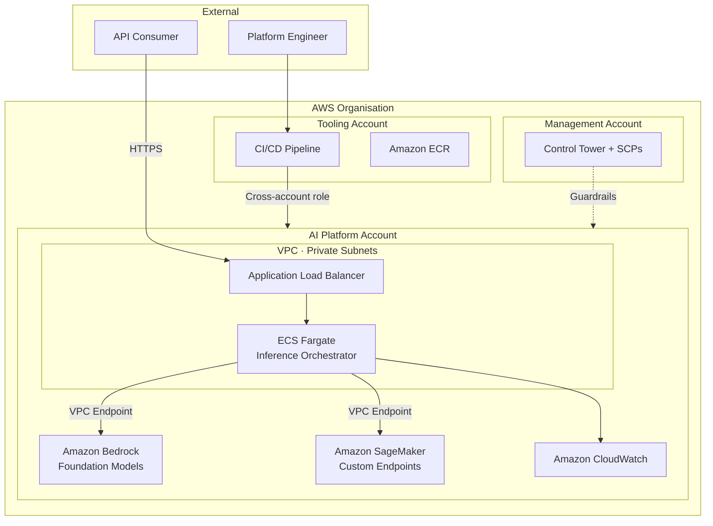
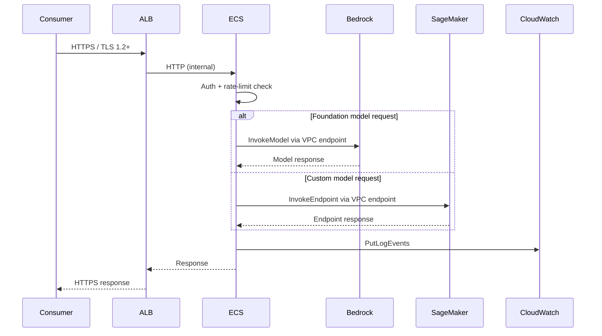

<!-- HERO BANNER PLACEHOLDER -->
<!-- Replace with: <p align="center"></p> -->

<h1 align="center">AI Platform Operations</h1>

<p align="center">
  <em>An AWS-native operational framework for running, governing, and scaling enterprise AI workloads.</em>
</p>

<p align="center">
  
  
  
  
  
</p>

---

## The Problem

Enterprise AI adoption stalls not at model capability but at operational readiness. Teams gain access to Amazon Bedrock and Amazon SageMaker but lack the consistent infrastructure, security posture, and governance controls needed to operate AI at production scale. This framework is the operational layer that closes that gap.

---

## What This Framework Provides

<table>
<tr>
  <td><strong>🔁 DevOps</strong></td>
  <td>CI/CD pipeline with plan → validate → approve → apply and environment promotion gates across dev, staging, and production.</td>
</tr>
<tr>
  <td><strong>🏗️ Platform Engineering</strong></td>
  <td>Four reusable Terraform modules providing a versioned, independently deployable infrastructure foundation.</td>
</tr>
<tr>
  <td><strong>🔒 Security</strong></td>
  <td>IAM least-privilege per principal, private AI service connectivity via VPC endpoints, KMS encryption, and continuous compliance via AWS Config and GuardDuty.</td>
</tr>
<tr>
  <td><strong>📋 Governance</strong></td>
  <td>AI model registration and deployment gates, cost allocation through mandatory tagging, and immutable audit trails via CloudTrail.</td>
</tr>
</table>

---

## Architecture

### System Context



### Inference Data Flow



---

## AWS Services

| Service | Role | Why This Choice |
|---|---|---|
| Amazon Bedrock | Foundation model inference | Serverless FM API — no GPU provisioning |
| Amazon SageMaker | Custom model hosting and lifecycle | Owns the full custom model deployment workflow |
| Amazon ECS Fargate | Inference orchestration | Task-level billing, no cluster node management |
| Amazon VPC + VPC Endpoints | Private network boundary | Keeps AI traffic off the public internet |
| Application Load Balancer | TLS termination, routing | Native ECS integration, path-based routing |
| Amazon CloudWatch + AWS X-Ray | Metrics, logs, traces | Native signal collection — no additional agents |
| AWS IAM | Access control | Per-principal least-privilege, single review point |
| AWS KMS | Encryption at rest | Customer-managed keys, full audit trail |
| AWS Secrets Manager | Credential management | Automatic rotation, IAM-controlled access |
| Amazon S3 + DynamoDB | Terraform remote state | AWS-native, SSE-KMS encrypted, state locking |
| AWS CloudTrail + AWS Config | Audit and compliance | Immutable API history, continuous rule evaluation |

---

## IaC Structure

```
terraform/
├── environments/
│   ├── dev/          # Low-cost config, single NAT gateway
│   ├── staging/      # Production-equivalent sizing, approval gate
│   └── prod/         # Full HA, deletion protection, all alarms active
└── modules/
    ├── networking/   # VPC, subnets, NAT gateways, VPC endpoints
    ├── compute/      # ECS Fargate, ALB, target-tracking auto scaling
    ├── iam/          # Least-privilege roles — single point of IAM review
    └── ai-services/  # SageMaker endpoints, CloudWatch alarms
```

> Environments are separate directory trees, not Terraform workspaces — environment differences are explicit in code review.

---

## Key Design Decisions

<details>
<summary><strong>ADR-001 · Compute: ECS Fargate over EKS and Lambda</strong></summary>

ECS Fargate was selected over EKS because the platform runs a single inference orchestration service — Kubernetes adds operational complexity with no architectural benefit at this scope. Fargate's per-task billing eliminates idle EC2 capacity costs, and native ALB integration simplifies routing without a separate ingress controller. Relevant pillars: **Operational Excellence**, **Cost Optimisation**.

</details>

<details>
<summary><strong>ADR-002 · Bedrock for foundation models, SageMaker for custom models</strong></summary>

Amazon Bedrock eliminates the need to provision, patch, and scale GPU infrastructure for publicly available foundation models — the API is the endpoint. Amazon SageMaker is retained for custom-trained models where the full MLOps lifecycle (training, versioning, A/B deployment) is required. This split keeps each service doing what it does best. Relevant pillar: **Performance Efficiency**.

</details>

<details>
<summary><strong>ADR-003 · S3 + DynamoDB for Terraform remote state</strong></summary>

AWS-native remote state avoids a SaaS dependency (e.g., Terraform Cloud) while providing per-environment isolation through separate S3 prefixes and DynamoDB tables. All state files are SSE-KMS encrypted, and DynamoDB provides atomic state locking to prevent concurrent apply conflicts. Relevant pillars: **Security**, **Reliability**.

</details>

<details>
<summary><strong>ADR-004 · CloudWatch + X-Ray for observability</strong></summary>

CloudWatch with Container Insights captures ECS task metrics and logs natively; X-Ray provides distributed tracing across the ALB → ECS → Bedrock/SageMaker call chain without deploying a separate observability stack. SageMaker endpoint metrics and ALB access logs integrate directly, keeping all signals in one pane with no additional egress cost. Relevant pillar: **Operational Excellence**.

</details>

---

## AWS Well-Architected Alignment

| Pillar | Primary Controls |
|---|---|
| Operational Excellence | IaC-only deployments, CI/CD pipeline, ECS circuit-breaker rollback |
| Security | IAM least-privilege, VPC endpoints, KMS encryption, CloudTrail + GuardDuty |
| Reliability | Multi-AZ ECS placement, SageMaker `create_before_destroy`, DynamoDB state locking |
| Performance Efficiency | Bedrock serverless FM, target-tracking auto scaling, VPC endpoint latency reduction |
| Cost Optimisation | Per-task Fargate billing, mandatory cost-centre tagging, single NAT GW in non-prod |
| Sustainability | No idle EC2 fleet, auto scale-to-minimum, right-sized SageMaker instances |

---

## Non-Functional Requirements

| Attribute | Target |
|---|---|
| Availability | ≥ 99.9% |
| Latency | p95 ≤ 2s end-to-end |
| Throughput | ≥ 100 concurrent requests |
| RTO | ≤ 1 hour |
| RPO | ≤ 15 minutes |

---

## Documentation

| Document | Covers |
|---|---|
| [Solution Design](architecture/solution-design.md) | System context, component design, ADRs, Well-Architected alignment |
| [Security Design](architecture/security-design.md) | Threat model, IAM role design, network security, compliance controls |
| [Operational Design](architecture/operational-design.md) | CI/CD pipeline, observability, alerting thresholds, recovery runbooks |

---

## Getting Started

1. Ensure prerequisites: Terraform ≥ 1.5, AWS CLI v2, access to the S3 state backend (see `terraform/README.md`)
2. `cd terraform/environments/dev`
3. `terraform init`
4. `terraform plan -out=tfplan` — review the planned changes
5. `terraform apply tfplan`

> Staging and prod require an explicit approval gate before apply.

---

<p align="center">
  Built on the <a href="https://aws.amazon.com/architecture/well-architected/">AWS Well-Architected Framework</a> · Managed with <a href="https://www.terraform.io/">Terraform</a>
</p>
