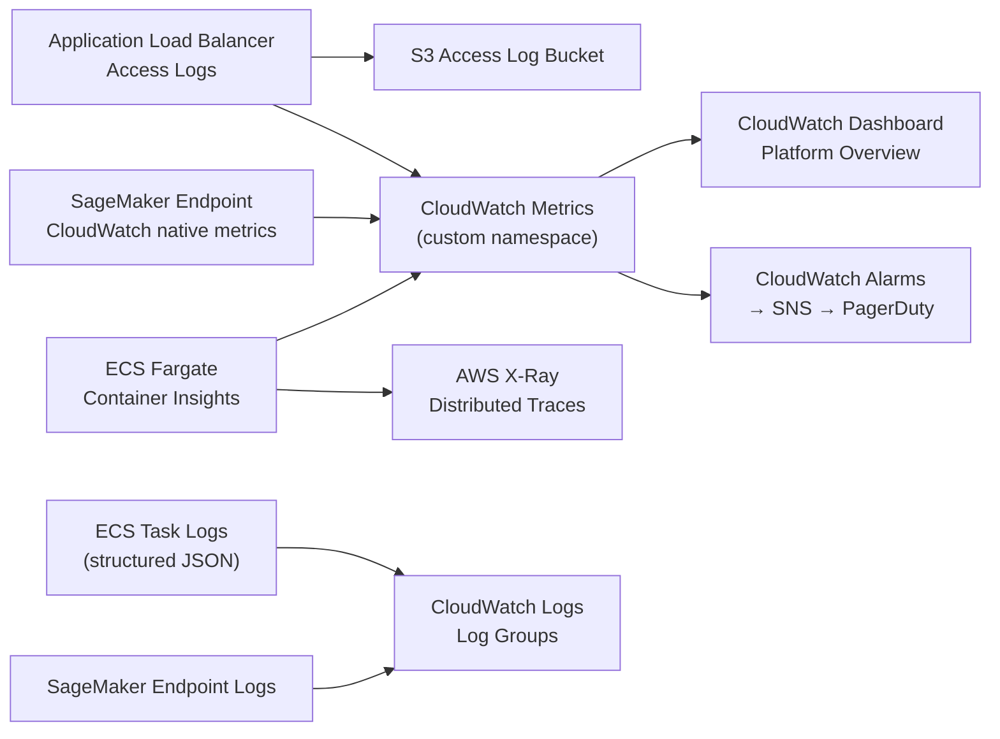

# Operational Design — AI Platform Operations

## Overview

This document defines how the AI Platform is deployed, monitored, and recovered. It covers the CI/CD deployment pipeline, observability strategy, alerting and incident management, capacity planning, backup and recovery, and operational runbooks.

The platform is operated by a platform team responsible for the infrastructure layer. Consuming teams interact with the inference API and are not involved in infrastructure operations. All infrastructure changes flow through the CI/CD pipeline described in this document.

---

## Deployment Strategy

### Pipeline Architecture

The deployment pipeline follows a plan → validate → approve → apply model with mandatory environment promotion gates. No direct console changes or manual `terraform apply` commands are permitted in staging or production.

```mermaid
flowchart LR
    PR["Pull Request\n(feature branch)"] --> Plan["terraform plan\n(CI check)"]
    Plan --> Validate["tflint + checkov\n(static analysis)"]
    Validate --> MergeGate["Peer Review\n(required approval)"]
    MergeGate --> Dev["Apply to dev\n(automatic)"]
    Dev --> StagingApproval["Staging Approval\n(manual gate)"]
    StagingApproval --> Staging["Apply to staging\n(manual trigger)"]
    Staging --> ProdApproval["Production Approval\n(lead + security)"]
    ProdApproval --> Prod["Apply to prod\n(manual trigger)"]
```

### Stage Definitions

| Stage | Environment | Trigger | Approval Required | Rollback Strategy |
|---|---|---|---|---|
| PR Validation | None (plan only) | Pull request opened | Peer review | Cancel and revise |
| Dev Apply | dev | Merge to `main` | Automatic | Re-apply previous version |
| Staging Apply | staging | Manual trigger after dev validation | Engineering lead | Re-apply or rollback |
| Production Apply | prod | Manual trigger after staging sign-off | Engineering lead + Security | ECS circuit breaker, SageMaker rollback |

### Deployment Types

**Infrastructure changes (Terraform):**
Changes to networking, IAM, or module configuration go through the full pipeline. The plan output is reviewed at the approval gate before apply.

**Container image updates (ECS):**
New container images are pushed to ECR by the application CI pipeline. ECS service deployments are triggered by updating the task definition image tag. Rolling deployment with circuit-breaker rollback is active in all environments.

**Model endpoint updates (SageMaker):**
New model artefacts are pushed to S3. A Terraform change updates the `model_data_url` variable and the `ai-services` module applies a new endpoint configuration using `create_before_destroy`. The old endpoint remains active until the new one passes health checks.

### Rollback Procedures

**ECS service rollback:**  
ECS deployment circuit breaker triggers automatic rollback to the previous task definition if health checks fail during rolling deployment. Manual rollback is executed by updating the ECS service to use the previous task definition ARN via Terraform.

**Terraform rollback:**  
Terraform does not have a native rollback command. Infrastructure rollback is executed by reverting the commit in the IaC repository and re-applying. State drift introduced by a partial apply is resolved using `terraform state` commands and targeted applies.

**SageMaker endpoint rollback:**  
The `create_before_destroy` pattern means the old endpoint is not deleted until the new endpoint is healthy. If the new endpoint fails during creation, Terraform errors and the old endpoint remains active.

---

## Observability

### Signal Collection Architecture

The platform collects three signal types: metrics, logs, and traces.

### Key Metrics

| Metric | Source | Namespace | Description |
|---|---|---|---|
| `TargetResponseTime` p95 | ALB | `AWS/ApplicationELB` | End-to-end inference latency |
| `RequestCount` | ALB | `AWS/ApplicationELB` | Total inference requests per minute |
| `UnhealthyHostCount` | ALB | `AWS/ApplicationELB` | Count of unhealthy ECS targets |
| `CPUUtilization` | ECS Container Insights | `ECS/ContainerInsights` | Task CPU usage |
| `MemoryUtilization` | ECS Container Insights | `ECS/ContainerInsights` | Task memory usage |
| `ModelLatency` | SageMaker | `AWS/SageMaker` | Model inference time (excluding orchestrator) |
| `InvocationErrorRate` | SageMaker | `AWS/SageMaker` | Percentage of 5xx endpoint responses |
| `Invocations` | SageMaker | `AWS/SageMaker` | Total endpoint invocations |
| `BedrockInvocations` | Custom (orchestrator) | `AI-Platform/Inference` | Bedrock API calls per model |
| `BedrockTokensConsumed` | Custom (orchestrator) | `AI-Platform/Inference` | Token consumption per model for cost tracking |

### Log Structure

All ECS task logs are emitted as structured JSON. Log fields:

| Field | Type | Description |
|---|---|---|
| `timestamp` | ISO 8601 | Event time |
| `level` | string | `INFO`, `WARN`, `ERROR` |
| `requestId` | UUID | Correlation ID across the inference path |
| `consumerId` | string | Identifying token for the API consumer |
| `modelType` | string | `bedrock` or `sagemaker` |
| `modelId` | string | Specific model or endpoint identifier |
| `latencyMs` | integer | Orchestrator-measured inference latency |
| `statusCode` | integer | HTTP response code returned to consumer |
| `errorCode` | string | AI service error code if applicable |

Log groups:

| Log Group | Source | Retention |
|---|---|---|
| `/ecs/ai-platform-{env}-orchestrator` | ECS task logs | 30 days |
| `/aws/sagemaker/Endpoints/{endpoint-name}` | SageMaker endpoint logs | 30 days |
| `/aws/ai-platform/{project}/{env}` | Platform operational logs | 90 days |

### CloudWatch Dashboard

A platform overview dashboard is maintained with the following widgets:

1. **Inference volume** — ALB `RequestCount` over time, split by 5-minute intervals
2. **End-to-end latency** — ALB `TargetResponseTime` p50, p95, p99
3. **Error rate** — ALB `HTTPCode_Target_5XX_Count` and SageMaker `InvocationErrorRate`
4. **ECS health** — `UnhealthyHostCount`, `CPUUtilization`, `MemoryUtilization`
5. **SageMaker latency** — `ModelLatency` p50 and p95 (isolates model vs. orchestrator latency)
6. **Token consumption** — `BedrockTokensConsumed` by model (cost visibility)

---

## Alerting and Incident Management

### Alert Definitions

| Alert | Threshold | Evaluation Period | Severity | Notification |
|---|---|---|---|---|
| High inference error rate | ALB 5xx rate > 5% | 5 minutes | P1 | SNS → PagerDuty (immediate) |
| High inference latency | p95 > 3 seconds | 5 minutes | P2 | SNS → PagerDuty (immediate) |
| Inference endpoint unavailable | `UnhealthyHostCount` > 0 | 2 minutes | P1 | SNS → PagerDuty (immediate) |
| SageMaker model latency | `ModelLatency` p95 > 2000ms | 5 minutes | P2 | SNS → Slack (high priority) |
| SageMaker invocation error rate | > 1% | 5 minutes | P2 | SNS → Slack (high priority) |
| ECS task CPU saturation | `CPUUtilization` > 85% | 10 minutes | P3 | SNS → Slack (informational) |
| ECS task memory saturation | `MemoryUtilization` > 90% | 10 minutes | P2 | SNS → PagerDuty |
| Bedrock token budget threshold | `BedrockTokensConsumed` > 80% of monthly budget | Daily | P3 | SNS → email |

### On-Call Model

The platform team maintains a weekly on-call rotation. P1 alerts page the on-call engineer immediately via PagerDuty. P2 alerts trigger during business hours unless they escalate to P1 within 15 minutes. P3 and P4 alerts are reviewed in the daily operational review.

Escalation path: on-call platform engineer → platform engineering lead → Head of Cloud.

---

## Capacity Planning

### Current Baseline

| Resource | Dev | Staging | Production |
|---|---|---|---|
| ECS tasks (min) | 1 | 2 | 2 |
| ECS tasks (max) | 4 | 10 | 20 |
| ECS task size | 0.5 vCPU / 1 GB | 1 vCPU / 2 GB | 1 vCPU / 2 GB |
| SageMaker instances | 0 (on-demand) | 1 × ml.g5.xlarge | 1 × ml.g5.2xlarge |
| NAT gateways | 1 (shared) | 1 (shared) | 2 (one per AZ) |

### Scaling Triggers

ECS scales out when ALB `RequestCountPerTarget` exceeds 1000 requests per target per minute. Scale-in occurs after a 300-second cooldown period to avoid flapping under oscillating load.

SageMaker endpoint scaling is evaluated monthly against the `ModelLatency` p95 baseline. If the p95 consistently approaches the 2-second threshold, the instance type is right-sized upward or an additional instance is added to the endpoint configuration.

### Capacity Review Cadence

Monthly capacity review covers:
- ECS task utilisation trends (average CPU and memory over the trailing 30 days)
- SageMaker endpoint invocation count and latency trends
- Bedrock token consumption versus budget
- ALB `RequestCount` growth rate (used for 90-day capacity projection)

---

## Backup and Recovery

### Recovery Objectives

| Component | RTO | RPO | Recovery Method |
|---|---|---|---|
| ECS inference service | 15 minutes | N/A (stateless) | ECS service restart or task definition rollback |
| SageMaker endpoint | 30 minutes | N/A (stateless) | Terraform re-apply of `ai-services` module |
| Terraform state | 60 minutes | 1 hour | S3 versioning restore from previous object version |
| Model artefacts (S3) | 60 minutes | 24 hours | S3 versioning restore or cross-region replication restore |
| Secrets Manager | 15 minutes | N/A | Secrets Manager secrets are replicated across AZs by AWS |

The ECS inference service is stateless — there is no persistent data to recover. Recovery means redeploying healthy tasks. The SageMaker endpoint serves a model that lives in S3; recovery means recreating the endpoint resource, which points to the existing model artefact.

### S3 Versioning and Retention

The following S3 buckets have versioning enabled:

- Terraform state bucket — all versions retained; lifecycle rule deletes non-current versions after 90 days
- Model artefact bucket — all versions retained; lifecycle rule moves non-current versions to S3 Glacier after 30 days

### Disaster Recovery Runbook

**Scenario: Terraform state bucket accidentally deleted**

1. Confirm the bucket is gone: check S3 console and CloudTrail for `DeleteBucket` event
2. Identify the actor in CloudTrail; revoke their access if the deletion was unauthorised
3. Restore the bucket from AWS Backup (if configured) or recreate it with the same name and re-import state from a recent S3 version
4. If no backup exists, reconstruct state by running `terraform import` for each resource using the CloudTrail resource creation history
5. Apply an SCP to prevent `s3:DeleteBucket` on the state bucket going forward

**Scenario: Production SageMaker endpoint unavailable**

1. Check the endpoint status in SageMaker console or via `sagemaker:DescribeEndpoint`
2. If the endpoint is `InService` but returning errors, check SageMaker endpoint logs in CloudWatch
3. If the endpoint is `Failed` or `OutOfService`, run `terraform apply` for the `ai-services` module to recreate it from the existing endpoint configuration
4. If model artefacts in S3 are corrupted, restore from S3 versioning before re-applying
5. Confirm recovery by checking the ALB `UnhealthyHostCount` alarm clears

---

## Operational Runbooks

### Runbook: Deploying a New Model to Staging

1. Upload the model artefact to the staging model artefact S3 bucket:
   `s3://ai-platform-models-staging/{model-name}/{version}/model.tar.gz`
2. Create a pull request in the IaC repository updating `model_data_url` in `environments/staging/terraform.tfvars`
3. The CI pipeline runs `terraform plan` and posts the plan diff as a PR comment
4. Engineering lead reviews and approves the PR
5. Trigger the staging apply pipeline stage; monitor the ECS service and SageMaker endpoint during rollout
6. Verify inference latency and error rate alarms remain clear for 10 minutes post-deployment
7. Record the deployment in the change log

### Runbook: Responding to High Latency Alert

1. Check CloudWatch dashboard — identify whether the latency spike is on ALB `TargetResponseTime` (end-to-end) or SageMaker `ModelLatency` (model only)
2. If SageMaker `ModelLatency` is high but ALB latency is proportionally higher: the orchestrator is contributing latency — check ECS CPU and memory utilisation
3. If SageMaker `ModelLatency` is high and matches the ALB latency delta: the model endpoint is the bottleneck — check `InvocationCount` for a throughput spike
4. If throughput is within normal range but latency is high: check for SageMaker service health events in the AWS Service Health Dashboard
5. If ECS CPU is above 80%: check if Auto Scaling has triggered; if not, manually adjust the ECS service desired count as a temporary measure
6. Document the incident timeline and contributing factors in the incident management tool

### Runbook: Rotating API Credentials

1. Generate a new credential value (API key, token, or password)
2. Add the new credential as a new version of the existing Secrets Manager secret
3. Update the ECS service to force a new task deployment — tasks will retrieve the new secret version at startup
4. Confirm all tasks are using the new version by checking CloudWatch logs for credential retrieval events
5. Revoke the old credential in the upstream system
6. Allow the secret's previous version to age out per the rotation policy (7 days)
