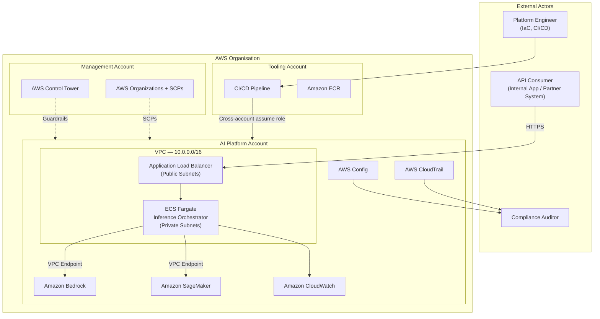
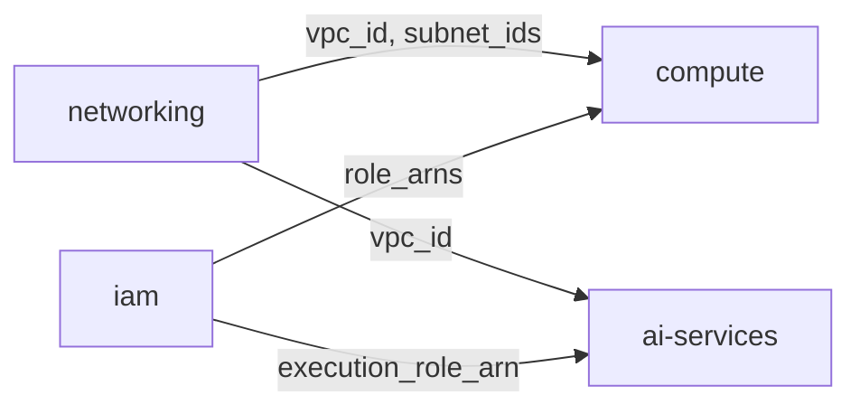
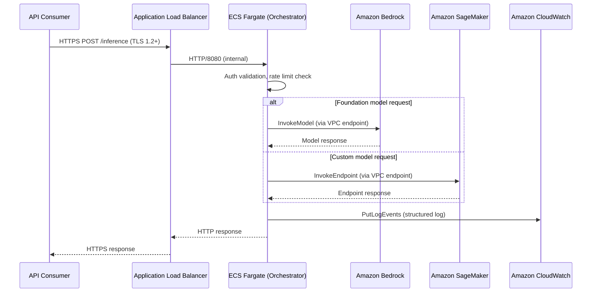

# Solution Design — AI Platform Operations

## Overview

This document describes the architecture of the AI Platform Operations framework: an AWS-native operational system for running, governing, and scaling enterprise AI workloads. It covers system context, component design, data flow, architecture decision records, and alignment to the AWS Well-Architected Framework.

The platform is not a single application. It is a structured set of infrastructure modules, operational patterns, and governance controls that a platform team uses to provide a consistent, secure, and observable AI runtime to consuming teams.

---

## Architecture Goals

1. **Security by default** — no workload reaches production without passing IAM least-privilege review, encryption validation, and network isolation checks.
2. **Reproducible environments** — all infrastructure is code; any environment can be re-created from source in under 30 minutes.
3. **Observable at every layer** — metrics, logs, and traces are available for inference requests, infrastructure, and platform operations without custom instrumentation.
4. **Cost-transparent** — every resource carries allocation tags; cost attribution by team, environment, and model is available in AWS Cost Explorer within 24 hours of creation.
5. **Governed at scale** — AI model deployments are gated by approval workflows; policy violations are detected automatically; audit trails are immutable.

### Non-Functional Requirements

| NFR | Target | Measurement Method |
|---|---|---|
| Availability | ≥ 99.9% uptime | CloudWatch availability metric, 30-day rolling window |
| Inference latency | p95 ≤ 2 seconds | ALB `TargetResponseTime` p95 |
| Throughput | ≥ 100 concurrent requests | ALB `ActiveConnectionCount` under load test |
| RTO | ≤ 1 hour | Time from incident declaration to service restoration |
| RPO | ≤ 15 minutes | Maximum data loss for stateful components |
| Deployment lead time | Same-day on-demand | CI/CD pipeline end-to-end execution time |
| Change failure rate | < 5% | Deployment circuit-breaker trigger rate |

---

## System Context

The AI Platform operates within an AWS Organisation managed through AWS Control Tower. The platform account is a spoke account governed by Service Control Policies applied at the organisation unit level.



---

## Component Design

### Module Dependency Model

The platform is composed of four Terraform modules with explicit dependency ordering:



`networking` and `iam` have no upstream dependencies and can be applied in parallel. `compute` and `ai-services` consume outputs from both.

### networking

Provisions the complete network foundation: VPC, public and private subnets across two availability zones, internet gateway, NAT gateways, route tables, and VPC interface endpoints for Bedrock, SageMaker Runtime, ECR, CloudWatch Logs, and S3.

The VPC endpoint configuration is a critical security control: all AI service API calls originate from private subnets and resolve to endpoint ENIs within the VPC. Traffic never traverses a NAT gateway or the public internet for AI service calls.

**CIDR allocation:**

| Subnet | AZ-a | AZ-b |
|---|---|---|
| Public | 10.0.1.0/24 | 10.0.2.0/24 |
| Private | 10.0.11.0/24 | 10.0.12.0/24 |

### compute

Provisions an ECS Fargate cluster hosting the inference orchestrator service. The orchestrator is a stateless container that handles request routing, authentication validation, rate limiting, and response formatting for both Bedrock and SageMaker inference paths.

Key operational features:
- Rolling deployment with circuit-breaker rollback on health check failure
- Target tracking auto scaling on ALB `RequestCountPerTarget` (threshold: 1000)
- Container Insights enabled for task-level CPU, memory, and network metrics
- Security group design enforces that ECS tasks accept traffic only from the ALB security group

### iam

Defines all IAM roles and policies. No other module creates IAM resources — this separation makes privilege escalation paths auditable in a single location.

| Role | Principal | Scope |
|---|---|---|
| ECS Task Execution | `ecs-tasks.amazonaws.com` | ECR pull, CloudWatch Logs write, Secrets Manager read |
| ECS Task Runtime | `ecs-tasks.amazonaws.com` | `bedrock:InvokeModel` on approved ARNs, `sagemaker:InvokeEndpoint` on approved ARNs |
| SageMaker Execution | `sagemaker.amazonaws.com` | S3 model artefact access, ECR pull, CloudWatch Logs |
| CI/CD Deployment | External account via STS | Terraform plan/apply permissions scoped to platform resources |

All runtime roles use IAM condition keys (`aws:RequestedRegion`, `aws:ResourceTag/Project`, `iam:PassedToService`) to bound the effective permission scope.

### ai-services

Provisions the SageMaker model lifecycle: model resource, endpoint configuration, and real-time endpoint. Also defines CloudWatch log groups and metric alarms for AI inference observability.

Bedrock requires no infrastructure provisioning — it is a serverless API. The `ai-services` module owns the SageMaker endpoint lifecycle only.

**SageMaker endpoint design:**
- Network isolation enabled: the model container cannot make outbound calls
- `create_before_destroy` lifecycle for zero-downtime model updates
- CloudWatch alarms: `ModelLatency > 2000ms` and `InvocationErrorRate > 1%`


---

## Data Flow

### Inference Request Path



All API calls from ECS to Bedrock and SageMaker resolve through VPC interface endpoints. The endpoint DNS entries are created automatically when the networking module provisions the VPC endpoints. No additional DNS configuration is required.

---

## Architecture Decision Records

### ADR-001: Compute — ECS Fargate over EKS and Lambda

**Status:** Accepted

**Context:** The inference orchestrator is a stateless HTTP service with variable load patterns, persistent connection requirements for streaming responses, and a small initial team (3–6 platform engineers).

**Options evaluated:**

| Factor | ECS Fargate | EKS | Lambda |
|---|---|---|---|
| Operational overhead | Low | High (node management, add-ons, upgrades) | Very low |
| Persistent connections | Supported | Supported | Not supported (15 min max) |
| ALB integration | Native | Requires AWS LBC add-on | Native but constrained |
| Cold start | ~30 seconds (acceptable) | Low (running pods) | High for large containers |
| Team expertise barrier | Low | High | Medium |
| Cost model | Per-task vCPU/memory | EC2 node group (idle capacity) | Per-invocation |

**Decision:** ECS Fargate.

EKS operational complexity does not justify its benefits for a single-service platform at this team size. Lambda's 15-minute execution limit and lack of persistent connection support rule it out for streaming inference. ECS Fargate provides task-level billing, native ALB integration, and Container Insights without Kubernetes overhead.

**Consequences:** If the platform grows to dozens of services with complex inter-service routing, EKS should be re-evaluated.

**Well-Architected Pillars:** Operational Excellence (reduced overhead), Cost Optimisation (task-level billing).

---

### ADR-002: AI Services — Bedrock for Foundation Models, SageMaker for Custom Models

**Status:** Accepted

**Context:** Two categories of AI inference are required: access to pre-trained foundation models (Claude, Titan, Llama) and deployment of organisation-trained or fine-tuned models.

**Decision:** Amazon Bedrock for foundation model inference; Amazon SageMaker for custom model hosting. The ECS orchestrator routes requests to the appropriate service based on model type.

**Rationale:** Using SageMaker to host publicly available foundation models would require procuring model weights, managing GPU instances, and building serving infrastructure — work Bedrock handles transparently with a serverless API and per-token pricing. SageMaker remains the correct choice for custom models where the organisation owns the weights, requires specific hardware configurations, or needs model monitoring and A/B testing capabilities.

**Consequences:** The `ai-services` module manages SageMaker resources only. Bedrock is accessed solely through IAM. The orchestrator implements routing logic based on model type.

**Well-Architected Pillars:** Performance Efficiency (right tool per category), Cost Optimisation (no idle GPU for FM access), Operational Excellence (reduced surface area).

---

### ADR-003: State Management — S3 + DynamoDB Remote Backend

**Status:** Accepted

**Context:** Terraform state must be durable, accessible from CI/CD, and protected against concurrent modifications. Options: local state, Terraform Cloud, S3 + DynamoDB, HashiCorp Consul.

**Decision:** S3 backend with SSE-KMS encryption and DynamoDB conditional write locking. One state file per environment.

**Rationale:** Terraform Cloud introduces an external SaaS dependency not justified for a bounded environment set. Local state is incompatible with CI/CD. Consul adds infrastructure to manage. S3 + DynamoDB is the AWS-native standard: S3 provides durable versioned object storage; DynamoDB conditional writes provide optimistic locking; KMS provides at-rest encryption without additional tooling.

**State layout:**
```
s3://ai-platform-terraform-state-<account>/
  ai-platform-operations/
    dev/terraform.tfstate
    staging/terraform.tfstate
    prod/terraform.tfstate
```

**Consequences:** The S3 bucket and DynamoDB table must be bootstrapped before the first apply. State files contain sensitive values and are access-controlled to the CI/CD deployment role and platform team roles only.

**Well-Architected Pillars:** Reliability (durable state), Security (KMS encryption, access control), Operational Excellence (predictable per-environment isolation).

---

### ADR-004: Observability — CloudWatch Primary, X-Ray for Distributed Tracing

**Status:** Accepted

**Context:** The platform requires metrics, logs, and traces for ECS task health, ALB performance, SageMaker inference latency, and Bedrock API call patterns. Options: CloudWatch + X-Ray, Datadog, Grafana + Prometheus + Loki, OpenTelemetry with third-party backend.

**Decision:** Amazon CloudWatch for metrics and logs; AWS X-Ray for distributed tracing.

**Rationale:** CloudWatch is already the native destination for ECS Container Insights, ALB access logs, SageMaker endpoint metrics, and CloudTrail events. Routing these to a third-party platform requires additional agents, network egress, and cross-vendor IAM. X-Ray integrates with ECS via a sidecar container and provides end-to-end traces across the ALB → ECS → Bedrock/SageMaker path, which is essential for diagnosing latency contributions from the orchestrator versus the model layer.

If multi-account, multi-region observability aggregation becomes a requirement, Amazon Managed Grafana can consume CloudWatch data sources without changing the underlying signal collection.

**Consequences:** Teams unfamiliar with CloudWatch Logs Insights syntax face a learning curve. CloudWatch alarms notify via SNS topics wired to the organisation's incident management tooling.

**Well-Architected Pillars:** Operational Excellence (unified observability), Cost Optimisation (no third-party egress costs), Reliability (native AWS health event integration).


---

## Well-Architected Alignment

| Pillar | Component / Decision | How the Pillar Is Addressed |
|---|---|---|
| **Operational Excellence** | CI/CD pipeline (plan → validate → approve → apply) | Deployments are automated, repeatable, and auditable. Manual intervention is confined to approval gates. |
| **Operational Excellence** | ECS deployment circuit breaker + auto-rollback | Failed deployments revert automatically, reducing MTTR without operator intervention. |
| **Operational Excellence** | CloudWatch Container Insights + structured logging | Platform state is continuously observable; runbooks reference named metrics and log queries. |
| **Operational Excellence** | IaC-only infrastructure, no console changes | Infrastructure state is version-controlled; changes are traceable to commits and pull request reviews. |
| **Security** | IAM least-privilege per principal, resource-scoped condition keys | Blast radius of any credential compromise is bounded to a single role's permission set. |
| **Security** | VPC endpoints for all AI service calls | No inference traffic traverses the internet; eliminates network-level interception risk for model I/O. |
| **Security** | KMS encryption for state, model volumes, and log groups | Data at rest is encrypted with customer-managed keys; key rotation is enforced by policy. |
| **Security** | CloudTrail + AWS Config + Security Hub | Continuous compliance monitoring; all API calls recorded; findings aggregated for security review. |
| **Reliability** | Multi-AZ ECS task placement, ALB cross-zone load balancing | Single AZ failure does not interrupt inference availability. |
| **Reliability** | SageMaker `create_before_destroy` for endpoint updates | Model updates do not interrupt serving; rollback is available if the new endpoint fails health checks. |
| **Reliability** | S3 remote state with DynamoDB locking | Concurrent Terraform operations cannot corrupt state; state is durably stored with versioning. |
| **Reliability** | RTO ≤ 1 hour, RPO ≤ 15 minutes, exercised in staging | Recovery objectives are explicit, tested, and documented in operational runbooks. |
| **Performance Efficiency** | Bedrock for FM access (serverless, no idle GPU) | Foundation model inference does not require provisioned capacity; scales to zero between requests. |
| **Performance Efficiency** | ECS target tracking auto scaling on ALB request count | Compute capacity tracks demand without over-provisioning; target tracking minimises response lag. |
| **Performance Efficiency** | VPC interface endpoints for Bedrock and SageMaker | Eliminates NAT gateway latency for AI API calls; reduces p95 inference latency by removing extra hops. |
| **Performance Efficiency** | X-Ray distributed tracing on inference path | Latency contributions from orchestrator versus model are distinguishable; optimisation is data-driven. |
| **Cost Optimisation** | Mandatory tagging strategy with cost centre tag | 100% of spend is attributable to project, environment, and team; showback reports are automated. |
| **Cost Optimisation** | `single_nat_gateway` flag for dev and staging | Non-prod environments use one shared NAT GW instead of one per AZ, reducing per-hour NAT costs. |
| **Cost Optimisation** | CloudWatch log retention policies (minimum 30 days, configurable) | Log storage costs are bounded; long-term retention tiers to S3 Glacier for compliance archiving. |
| **Sustainability** | Fargate task-level billing, no idle EC2 fleet | Compute is consumed only when inference tasks run; no always-on capacity beyond the HA minimum. |
| **Sustainability** | Auto Scaling scale-to-minimum during off-peak | Minimum task count of 2 for HA; scale-down is automatic; no oversized standing fleet. |
| **Sustainability** | Right-sized SageMaker instance selection | GPU instances match model requirements; over-provisioning is surfaced through SageMaker Model Monitor utilisation metrics. |

---

## Scalability Considerations

**Horizontal scaling (ECS):** The Auto Scaling target tracking policy adds ECS tasks when ALB `RequestCountPerTarget` exceeds the configured threshold (default: 1000 requests/target). Scale-out completes in approximately 90 seconds from trigger to healthy task. Maximum capacity is configurable per environment.

**SageMaker endpoint scaling:** SageMaker Application Auto Scaling can be applied to the endpoint to add instances under load. For the initial deployment, a single `ml.g5.2xlarge` instance handles the expected request volume. Scaling policy configuration is a follow-on concern once production baseline metrics are established.

**Bedrock throughput:** Bedrock imposes per-account, per-region, per-model token-per-minute (TPM) and request-per-minute (RPM) quotas. Organisations with high-volume inference requirements should request quota increases via AWS Support before go-live. The orchestrator implements per-consumer rate limiting to prevent any single consumer from exhausting the account-level quota.

**Multi-region:** The current design is single-region. Bedrock cross-region inference profiles are available for selected models and provide implicit failover to a secondary region without application changes. Multi-region active-active deployment of the orchestrator layer is a documented future state requiring Route 53 latency-based routing and cross-region state synchronisation planning.
