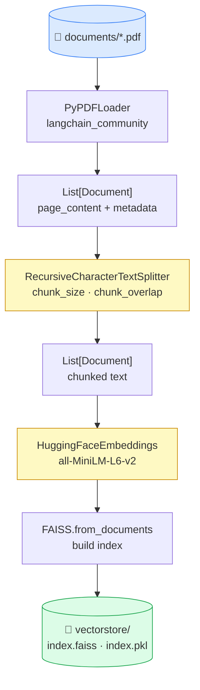
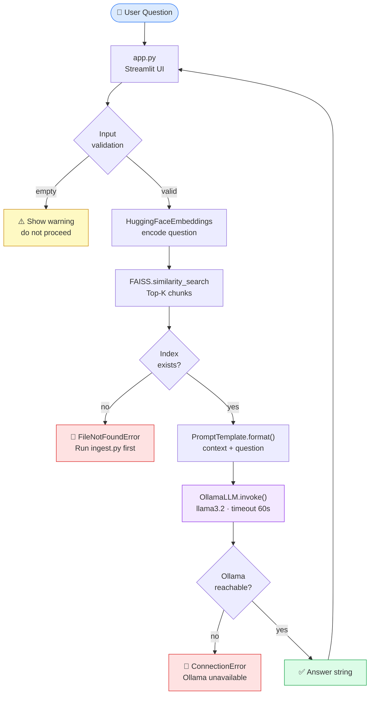
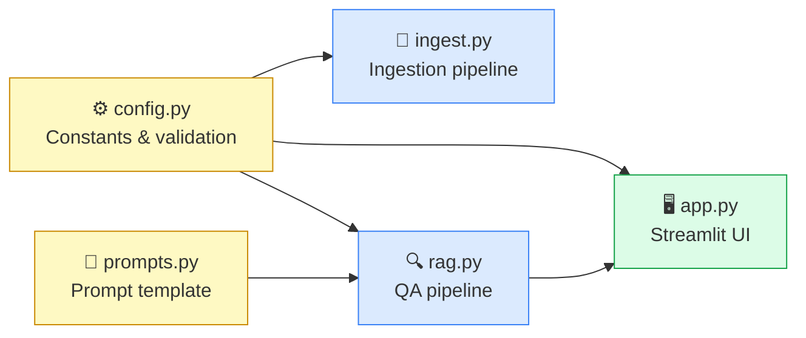

# 🔍 Intelligent Document Search

> Search efficiently through a collection of PDF documents using Retrieval Augmented Generation and LLM.

An end-to-end RAG pipeline built with open-source tools — LangChain, FAISS, HuggingFace sentence-transformers, Ollama, and Streamlit. Designed for developers who want to understand every step of the RAG workflow, from PDF ingestion to answer generation, in clean and readable Python.


---

## How It Works

```
PDF files → Text extraction → Chunking → Embeddings → FAISS index
                                                            ↓
User question → Query embedding → Similarity search → Top-K chunks → Prompt → Ollama LLM → Answer
```

Two workflows run independently:

| Workflow | Command | When to run |
|---|---|---|
| **Ingestion** (offline) | `python ingest.py` | Once per document set, or after adding/changing PDFs |
| **Question Answering** (online) | `streamlit run app.py` | Any time after ingestion |

---

## Tech Stack

| Layer | Tool | Purpose |
|---|---|---|
| UI | Streamlit | Minimal web interface |
| Orchestration | LangChain | Pipeline building blocks |
| Embeddings | `sentence-transformers/all-MiniLM-L6-v2` | Text → vector conversion |
| Vector store | FAISS | Similarity search over document chunks |
| LLM | Ollama (llama3.2) | Local answer generation |
| PDF loading | PyPDF | Text extraction from PDFs |

---

## Project Structure

```
simple-rag-demo/
├── app.py              # Streamlit web interface
├── ingest.py           # PDF ingestion and vector store creation
├── rag.py              # Retrieval and answer generation
├── prompts.py          # Prompt templates
├── config.py           # Tunable parameters (chunk size, model names, etc.)
├── requirements.txt    # Pinned Python dependencies
├── documents/          # Place your PDF files here
└── vectorstore/        # Auto-generated FAISS index (do not edit manually)
```

---

## Prerequisites

**System requirements:**

| Requirement | Version | Notes |
|---|---|---|
| Python | 3.12+ | [python.org/downloads](https://www.python.org/downloads/) |
| Git | any | [git-scm.com](https://git-scm.com/) |
| Ollama | latest | [ollama.com/download](https://ollama.com/download) |
| Disk space | ~4 GB | For embedding model cache (first run only) |

**Supported platforms:** macOS 12+, Ubuntu 20.04+, Windows 10/11

> On Windows, Ollama installs as a background service and starts automatically. You do not need to run `ollama serve` manually.

---

## Quickstart

### Step 1 — Install Ollama

<details>
<summary><b>macOS</b></summary>

```bash
brew install ollama
```
Or download the `.app` installer from [ollama.com/download](https://ollama.com/download).
</details>

<details>
<summary><b>Linux</b></summary>

```bash
curl -fsSL https://ollama.com/install.sh | sh
```
</details>

<details>
<summary><b>Windows</b></summary>

Download and run the installer from [ollama.com/download](https://ollama.com/download). Ollama starts automatically as a background service after installation — no need to run `ollama serve`.

If `ollama` is not recognised after install, open a new terminal window to pick up the updated PATH.
</details>

Verify:
```bash
ollama --version
```

---

### Step 2 — Pull the LLM

```bash
ollama pull llama3.2
```

Downloads the model weights (~2 GB). Runs once; cached locally after that. To use a different model, see [Tuning for Better Responses](#tuning-for-better-responses).

---

### Step 3 — Get the Project

You only need the `simple-rag-demo/` folder — there is no need to clone the entire repository.

```bash
git clone --filter=blob:none --sparse https://github.com/<your-username>/Enterprise-AI-Solutions.git
cd Enterprise-AI-Solutions
git sparse-checkout set simple-rag-demo
cd simple-rag-demo
```

> **What this does:** `--sparse` with `--filter=blob:none` performs a partial clone — only the `simple-rag-demo/` directory is downloaded. Other projects in the repository are not fetched.

---

### Step 4 — Create a Virtual Environment

**macOS / Linux**
```bash
python3 -m venv .venv
source .venv/bin/activate
```

**Windows (PowerShell)**
```powershell
python -m venv .venv
.venv\Scripts\Activate.ps1
```

**Windows (Command Prompt)**
```cmd
python -m venv .venv
.venv\Scripts\activate
```

You should see `(.venv)` in your prompt.

---

### Step 5 — Install Dependencies

```bash
pip install -r requirements.txt
```

First install takes a few minutes. All versions are pinned for reproducibility.

---

### Step 6 — Add PDF Documents

Place your PDFs in the `documents/` directory:

```
documents/
├── annual-report.pdf
├── technical-spec.pdf
└── research-paper.pdf
```

Subdirectories are supported — all `.pdf` files are discovered recursively.

---

### Step 7 — Run the Ingestion Pipeline

```bash
python ingest.py
```

Expected output:
```
Loading PDFs...
  Loaded 142 page(s) from documents/
Splitting into chunks...
  Produced 312 chunk(s)
Building vector store...
Saving vector store to vectorstore/...
Ingestion complete.
```

> The embedding model (`all-MiniLM-L6-v2`) downloads from HuggingFace on first run (~90 MB). Subsequent runs use the local cache.

---

### Step 8 — Start Ollama

**macOS / Linux** — run in a separate terminal:
```bash
ollama serve
```

**Windows** — Ollama is already running as a background service after installation.

Verify it is reachable:
```bash
curl http://localhost:11434
```
Expected: `Ollama is running`

---

### Step 9 — Launch the App

```bash
streamlit run app.py
```

Open the printed URL in your browser (default: `http://localhost:8501`).

---

### Step 10 — Stopping the App

Press **Ctrl+C** in the terminal where Streamlit is running.

> On Windows, if Ctrl+C does not respond, close the terminal window directly. Your documents and vector store are unaffected.

---

## Using the App

1. Type a question (up to 200 characters) into the input field.
2. Click **Submit**.
3. A loading spinner appears while the pipeline runs.
4. The generated answer appears below, with the response time shown in small text.
5. Click **Retrieved Chunks** to expand and see the document excerpts used to generate the answer.
6. Click **Clear** to reset the input and start a new question.

**Example questions:**
- *"What are the key compliance requirements described in this document?"*
- *"Summarise the main risks identified."*
- *"What recommendations does the document make?"*

---

## Updating Your Documents

To add, remove, or replace PDFs:

1. Stop the app (`Ctrl+C`).
2. Update files in `documents/`.
3. Re-run ingestion:
   ```bash
   python ingest.py
   ```
4. Restart the app:
   ```bash
   streamlit run app.py
   ```

The ingestion pipeline always overwrites the existing vector store — no need to delete `vectorstore/` manually.

---

## Configuration

All parameters live in `config.py`. No other file needs editing for basic configuration.

```python
CHUNK_SIZE    = 1000    # Characters per document chunk
CHUNK_OVERLAP = 200     # Overlapping characters between consecutive chunks
TOP_K         = 4       # Number of chunks retrieved per query
EMBEDDING_MODEL = "sentence-transformers/all-MiniLM-L6-v2"
OLLAMA_MODEL    = "llama3.2"
DOCUMENTS_DIR   = "documents"
VECTORSTORE_DIR = "vectorstore"
```

> After changing `CHUNK_SIZE`, `CHUNK_OVERLAP`, or `EMBEDDING_MODEL`, re-run `python ingest.py` to rebuild the vector store.

---

## Tuning for Better Responses

If answers feel vague, off-topic, or incomplete, these are the main levers — listed in order of typical impact.

### 1. TOP_K — number of chunks retrieved

**File:** `config.py` &nbsp;|&nbsp; **Re-ingestion required:** No

`TOP_K` is how many document chunks are passed to the LLM as context. If the relevant passage isn't in the retrieved set, the model cannot answer correctly no matter what else is tuned.

| Value | Effect |
|---|---|
| `4` (default) | Fast; may miss relevant passages in longer documents |
| `6`–`8` | Broader context; recommended starting point |
| `10`–`20` | Maximum recall; slower, may dilute focus |

✅ **Try first:** `TOP_K = 6`

---

### 2. CHUNK_SIZE — characters per chunk

**File:** `config.py` &nbsp;|&nbsp; **Re-ingestion required:** Yes

The single biggest factor in retrieval precision. Too large and a chunk mixes unrelated topics; too small and the LLM gets fragments without context.

| Value | Best for |
|---|---|
| `200`–`400` | FAQs, short factual documents |
| `500`–`700` | Technical reports, compliance documents, research papers |
| `1000` (default) | General use |
| `1500`+ | Broad overviews where precision matters less |

✅ **Try first:** `CHUNK_SIZE = 600`

> Smaller chunks improve retrieval precision but increase ingestion time.

---

### 3. CHUNK_OVERLAP — overlap between chunks

**File:** `config.py` &nbsp;|&nbsp; **Re-ingestion required:** Yes

Overlap ensures sentences split at a boundary still appear intact in at least one chunk. Keep it at ~20–25% of `CHUNK_SIZE`.

| CHUNK_SIZE | Recommended CHUNK_OVERLAP |
|---|---|
| `600` | `120`–`150` |
| `800` | `160`–`200` |
| `1000` | `200` (default) |

✅ **Try first:** `CHUNK_OVERLAP = 150` (paired with `CHUNK_SIZE = 600`)

---

### 4. The prompt — answer behaviour

**File:** `prompts.py` &nbsp;|&nbsp; **Re-ingestion required:** No

The default prompt is minimal. For technical documents, more specific instructions improve answer quality. Replace `_TEMPLATE` in `prompts.py`:

```python
_TEMPLATE = """You are a precise assistant answering questions from document excerpts.
Use only the information in the context below. Be specific and direct.
If the context does not contain enough information to answer, say so clearly.

Context:
{context}

Question:
{question}

Answer:"""
```

---

### 5. OLLAMA_MODEL — the language model

**File:** `config.py` &nbsp;|&nbsp; **Re-ingestion required:** No

`llama3.2` is a 3B parameter model optimised for speed. Larger models produce noticeably better answers on complex documents.

| Model | Download size | Notes |
|---|---|---|
| `llama3.2` (default) | ~2 GB | Fast; good for simple lookups |
| `mistral` | ~4 GB | Better reasoning; recommended for technical documents |
| `llama3.1:8b` | ~5 GB | Strong general-purpose model |

```bash
ollama pull mistral
```
```python
# config.py
OLLAMA_MODEL = "mistral"
```

> `mistral` requires at least 8 GB of available system RAM.

---

### Recommended config for technical documents

```python
# config.py
CHUNK_SIZE    = 600
CHUNK_OVERLAP = 150
TOP_K         = 6
```

Re-run `python ingest.py` after applying, then restart the app.

---

## Architecture

### Ingestion Pipeline (offline)

Run once to process PDFs and build the searchable index.



---

### Question Answering Pipeline (online)

Runs on every question submitted through the Streamlit UI.



---

### Module Responsibilities



---

## Troubleshooting

<details>
<summary><b>documents/ directory not found or contains no PDF files</b></summary>

The `documents/` directory is empty or missing. Add at least one PDF and re-run `python ingest.py`.
</details>

<details>
<summary><b>Vector store not found. Run ingest.py first.</b></summary>

Ingestion has not been run yet, or was run from a different directory. Run `python ingest.py` from the project root.
</details>

<details>
<summary><b>Ollama is unavailable. Ensure it is running at localhost:11434.</b></summary>

Ollama is not running. On macOS/Linux, start it with `ollama serve`. On Windows, launch from the Start menu or check the system tray. Verify with `curl http://localhost:11434`.
</details>

<details>
<summary><b>Error: model 'llama3.2' not found</b></summary>

The model has not been pulled. Run `ollama pull llama3.2` (or whichever model is set in `config.py`).
</details>

<details>
<summary><b>Embedding model download is slow or fails</b></summary>

`all-MiniLM-L6-v2` downloads from HuggingFace on first run (~90 MB). Ensure you have an internet connection. Subsequent runs use the cache at `~/.cache/huggingface/`.
</details>

<details>
<summary><b>streamlit: command not found</b></summary>

The virtual environment is not active. Run the activate command from Step 4 before starting Streamlit.
</details>

<details>
<summary><b>Port 8501 is already in use</b></summary>

Run on a different port:
```bash
streamlit run app.py --server.port 8502
```
</details>

<details>
<summary><b>ollama is not recognised after installation on Windows</b></summary>

The PATH update from the installer only takes effect in new terminal sessions. Close your current terminal, open a new one, and retry `ollama --version`.
</details>

---

## License

[MIT](LICENSE)
